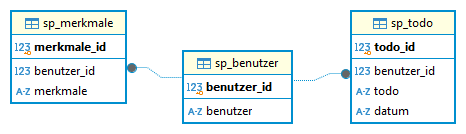
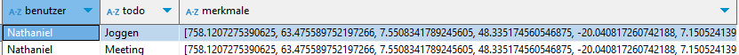
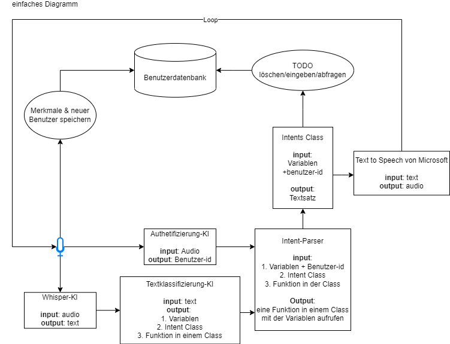
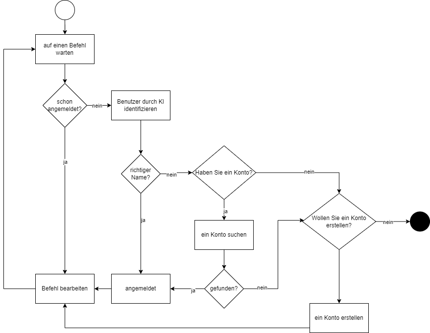

# Architektur für das Assistant AI Projekt

## 1. **Benutzerdatenbank Struktur**

- **Hauptinhalt**: Benutzerdaten, Merkmale, TODO
- **Merkmale**: Datensatz zur Trainings-Authentifikations-KI

## 2. **Textklassifizierungsdatenbank Struktur**

- **Hauptinhalt**: Sätze, Anmerkungen, Szenarien, Absichten

## 3. **KI-Technologie**
- **Intent- und Entitätserkennung (BERT Architektur)**: Modell zur Erkennung von Benutzereingaben und Entitäten wie Zeit, Ort und Aktivität.
- **Authentifizierung der Benutzer (CNN Modell)**: Identifiziert Benutzer durch Stimme.
- **Spracherkennungsmodell (Whisper)**: Transkribiert gesprochene Sprache.
- **Text-zu-Sprache-Modell (Microsoft)**: Generiert gesprochene Antworten aus Text.

## 4. **Benutzerschnittstellen**
- **Datensatz-Editor**: Ermöglicht das Bearbeiten von Textklassifizierungs-Datensätzen.

## 5. **Datenflussdiagramm**

## 6. **Authentifizierung/Anmeldung Aktivitätsdiagramm**
