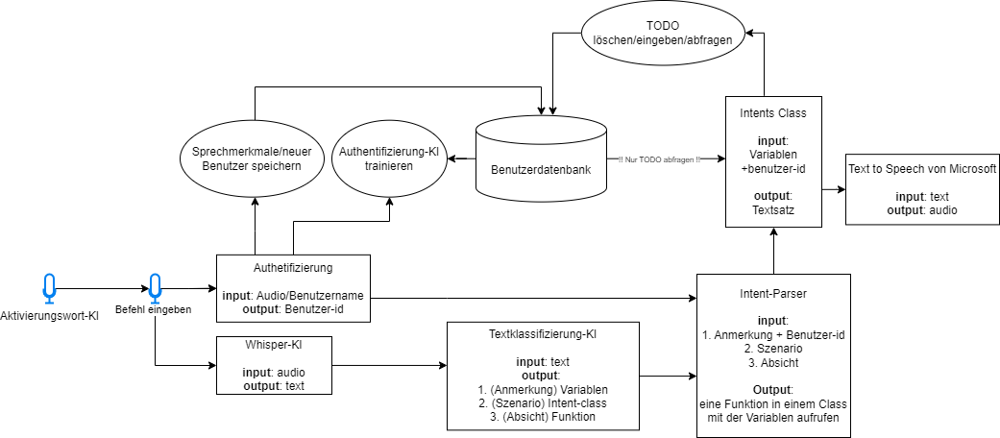
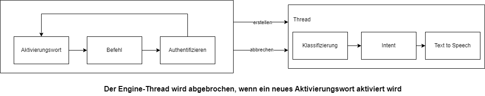

# Architektur für das Assistant AI Projekt

## 1. **Benutzerdatenbank Struktur**

- **Hauptinhalt**: Benutzerdaten, Merkmale, TODO
- **Merkmale**: Datensatz zur Trainings-Authentifikations-KI

## 2. **Aktivierungswort-Datenbank Struktur**

- **Hauptinhalt**: Sätze, Anmerkungen, Szenarien, Absichten

## 3. **Aktivierungswort-Datenbank Struktur**

## 4. **KI-Technologie**
- **Intent- und Entitätserkennung (BERT Architektur)**: erkennt Benutzereingaben und Entitäten
- **Authentifizierung der Benutzer (CNN-Modell)**: identifiziert Benutzer durch ihre Stimme
- **Aktivierungswort (CNN-Modell)**: identifiziert den Aufruf des Benutzers an den Assistenten
- **Spracherkennungsmodell (Whisper)**: transkribiert gesprochene Sprache in Text
- **Text-zu-Sprache-Modell (Coqui)**: generiert gesprochene Antworten aus Text 
  - Datensatz von Thorsten-Voice: [hier](https://github.com/thorstenMueller/Thorsten-Voice)
- **PDF-Verstehen (Ollama)**: beantwortet Fragen zu Inhalten eines PDFs

## 5. **Systemdiagramm**

## 6. **Authentifizierung/Anmeldung Flussdiagramm**

## 7. **Multithreading**

# Intents-Sturktur
Die Textklassifikation KI gibt einen Output in drei Hauptkategorien zurück:

1. **Szenario**: Dies ist der Klassenname, der das Kontextumfeld der Anfrage beschreibt.
2. **Absicht**: Dies ist die Funktion innerhalb der jeweiligen Klasse (Szenario).
3. **Anmerkung**: Dies sind die Variablen, die für die Absicht innerhalb des Szenarios verwendet werden.

## Beispiel:
- Wie ist das Wetter heute in Berlin?
  - **Szenario**: "Wetter"
  - **Absicht**: "abfragen"
  - **Anmerkung**: "Standort: Berlin", "Datum: heute"

- Lösche meine Besprechung morgen um 12 Uhr!
  - **Szenario**: "Todo-Liste"
  - **Absicht**: "löschen"
  - **Anmerkung**: "Aktivität: Besprechung", "Datum: morgen", "Uhrzeit: 12 Uhr"

- Um wie viel Uhr ist meine Besprechung am Freitag?
  - **Szenario**: "Todo-Liste"
  - **Absicht**: "abfragen"
  - **Anmerkung**: "Aktivität: Besprechung", "Datum: Freitag"