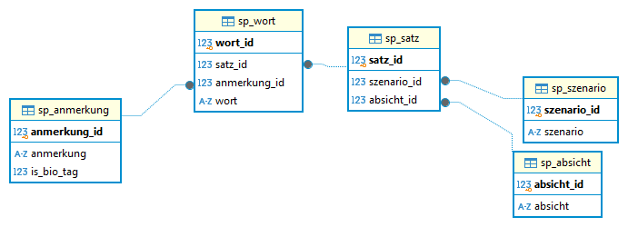
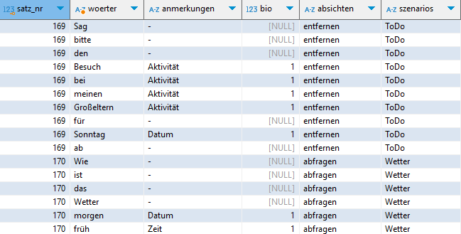
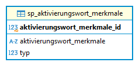
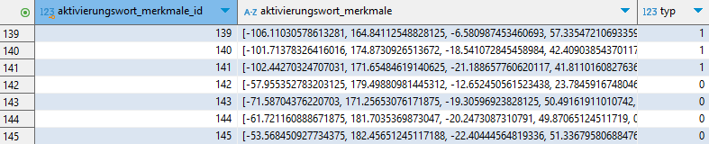
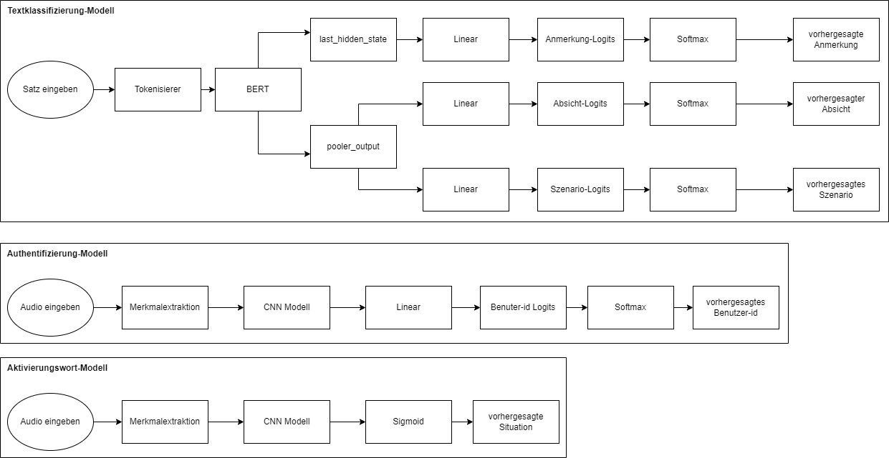
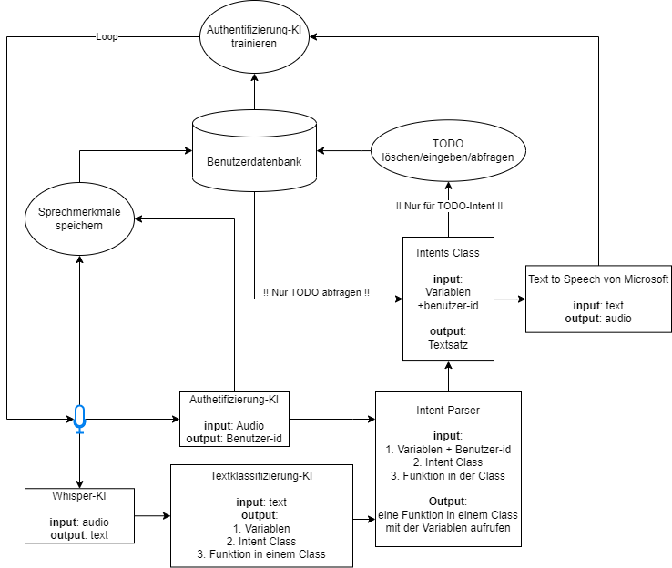
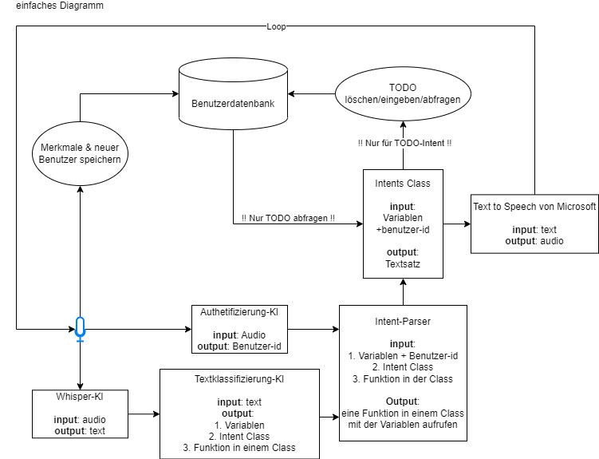
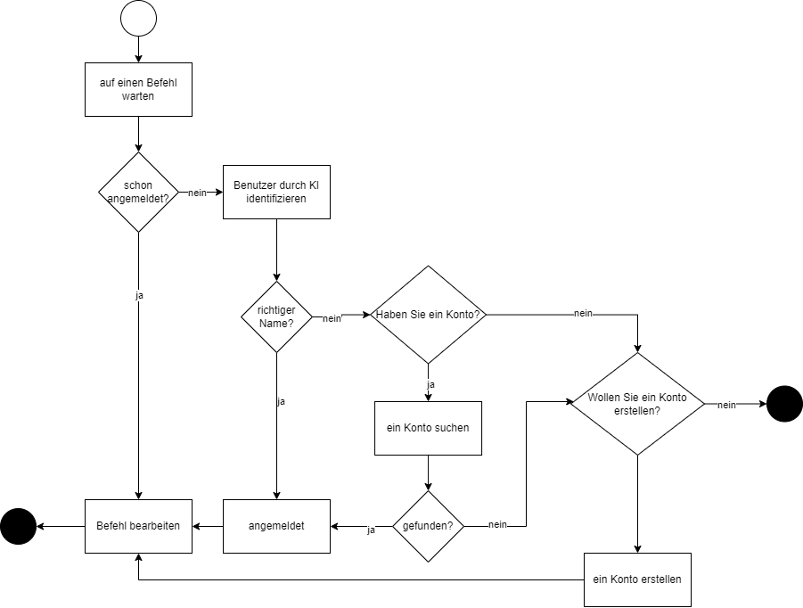
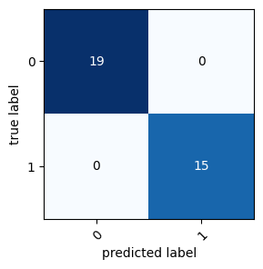

# Architektur für das Assistant AI Projekt

## 1. **Benutzerdatenbank Struktur**

- **Hauptinhalt**: Benutzerdaten, Merkmale, TODO
- **Merkmale**: Datensatz zur Trainings-Authentifikations-KI

## 2. **Aktivierungswort-Datenbank Struktur**

- **Hauptinhalt**: Sätze, Anmerkungen, Szenarien, Absichten

## 3. **Aktivierungswort-Datenbank Struktur**

## 4. **KI-Technologie**
- **Intent- und Entitätserkennung (BERT Architektur)**: erkennt Benutzereingaben und Entitäten
- **Authentifizierung der Benutzer (CNN-Modell)**: identifiziert Benutzer durch ihre Stimme
- **Aktivierungswort (CNN-Modell)**: identifiziert den Aufruf des Benutzers an den Assistenten
- **Spracherkennungsmodell (Whisper)**: transkribiert gesprochene Sprache in Text
- **Text-zu-Sprache-Modell (Microsoft)**: generiert gesprochene Antworten aus Text
- **PDF-Verstehen (Ollama)**: beantwortet Fragen zu Inhalten eines PDFs

## 5. **Datenflussdiagramm**

- **einfaches Version**

## 6. **Authentifizierung/Anmeldung Aktivitätsdiagramm**

## 7. **Confusion Matrix**

- Confusion Matrix von Authentifizierung-KI

- Confusion Matrix von Aktivierungswort-KI