## 1. **Plot**
### Confusion Matrix von Authentifizierung-KI

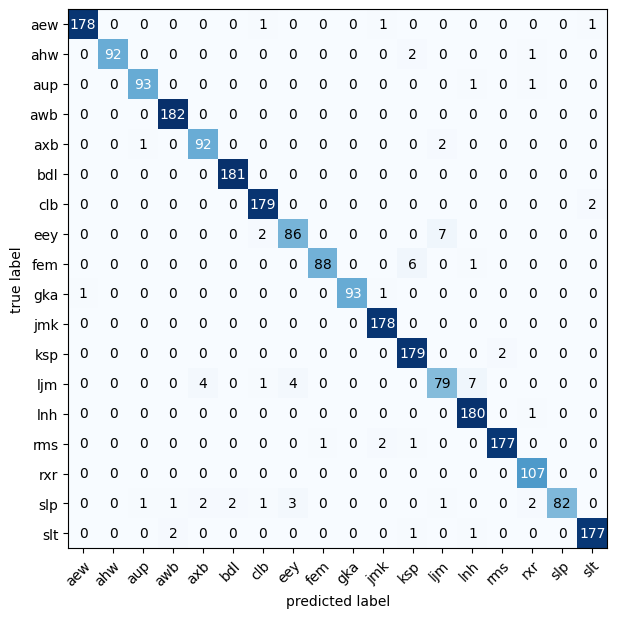

### Confusion Matrix von Aktivierungswort-KI

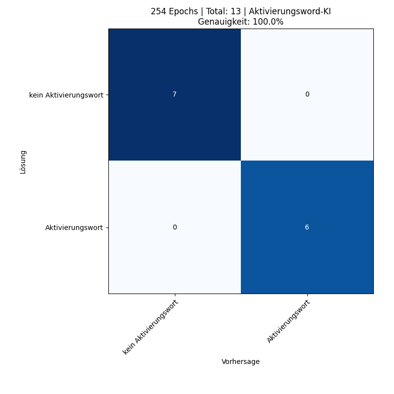

### Confusion Matrix von Textklassifizierung-KI (Anmerkung)

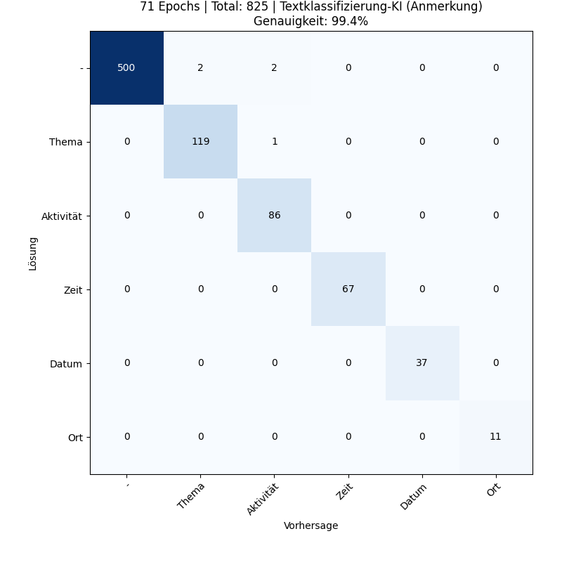

### Confusion Matrix von Textklassifizierung-KI (Absicht)

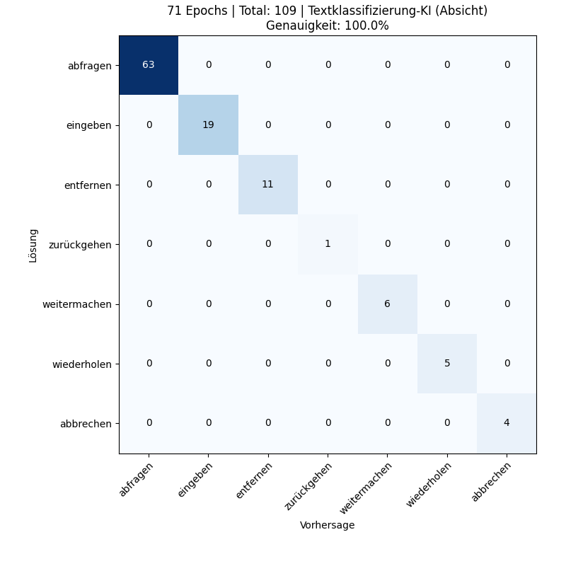

### Confusion Matrix von Textklassifizierung-KI (Szenario)

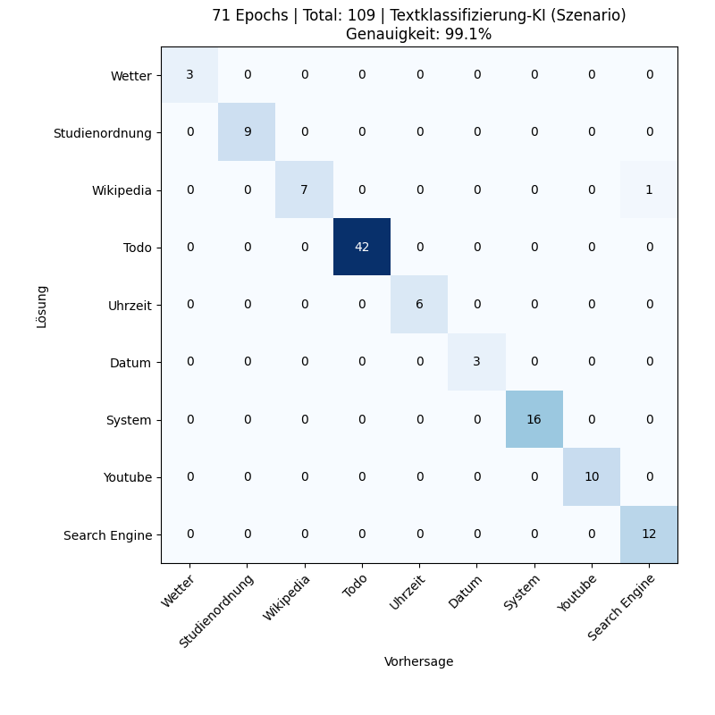

### Confusion Matrix von Textklassifizierung-KI (Szenario + Absicht)

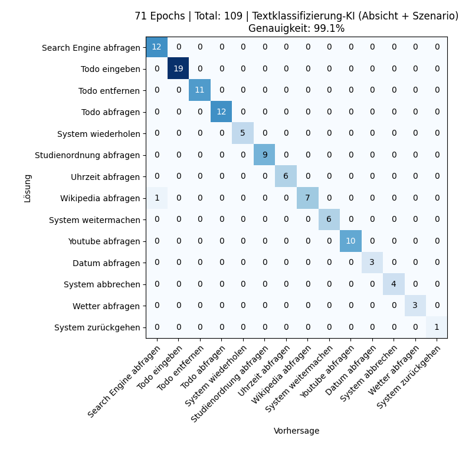

### Confusion Matrix von Textklassifizierung-KI (Szenario + Absicht + Anmerkung)

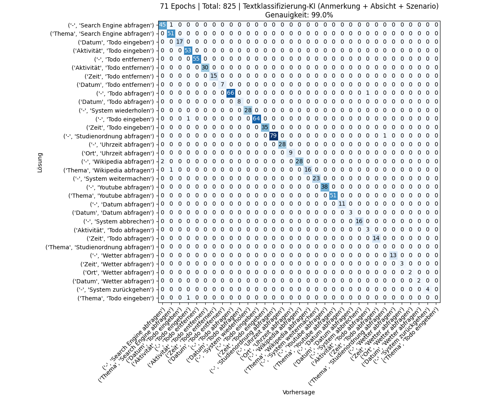

### Zusammenfassung von Aktivierungswort-KI
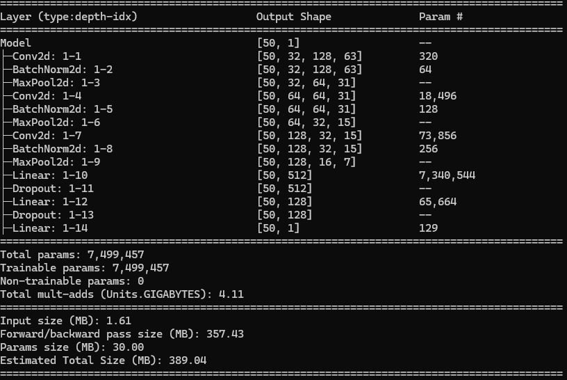

### Zusammenfassung von Authentifizierung-KI
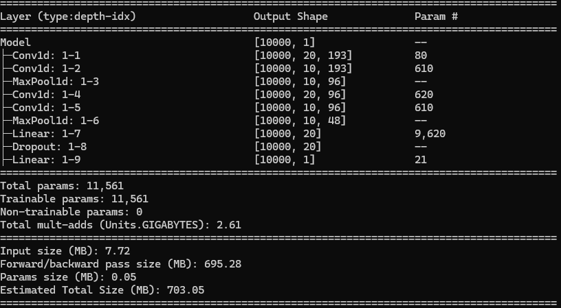

### Zusammenfassung von Textklassifizierung-KI
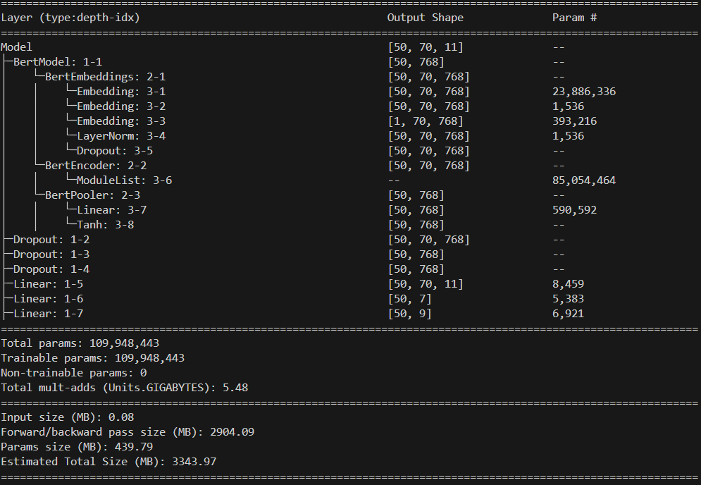

### Aktivierungswort vs kein Aktivierungswort
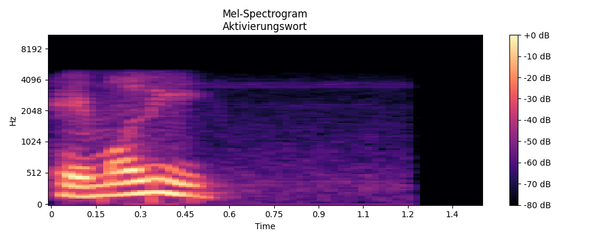
